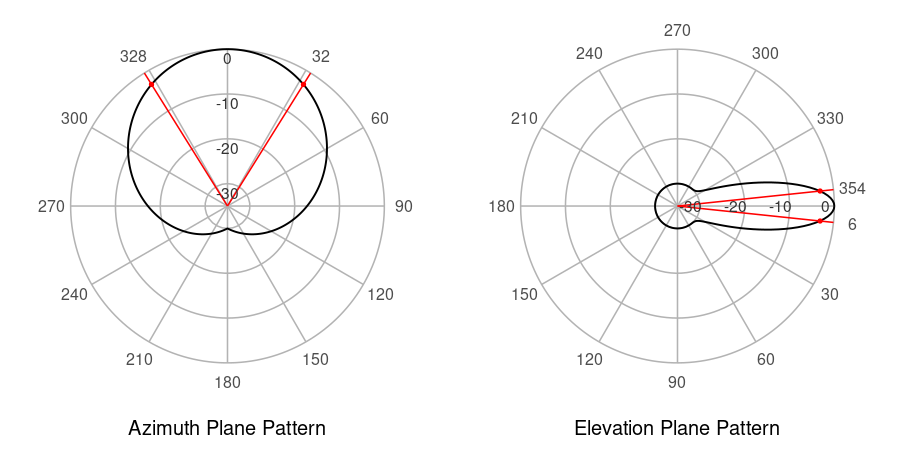
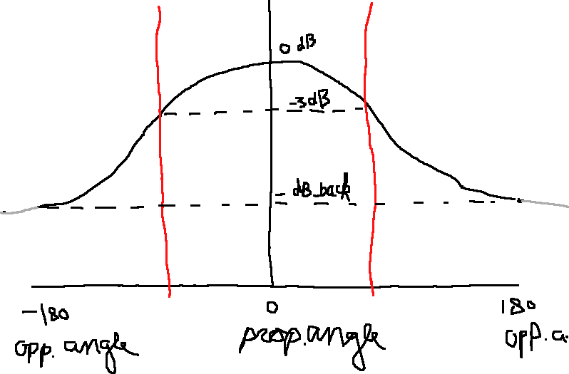

```{r setup, include=FALSE}
knitr::opts_chunk$set(echo = TRUE)
```


## Introduction

This document is to explain the implementation of the methods provided in mobloc.

```{r echo=FALSE, message=FALSE}
library(mobloc)
library(kableExtra)
#library(mobvis)
```

## Installing mobloc and mobvis

For reimplementing the methods, it could be useful to be able to run mobloc and mobvis. These can be installed by running these two lines of code in R:

```{r, eval=FALSE}
devtools::install_github("MobilePhoneESSnetBigData/mobloc")
devtools::install_github("MobilePhoneESSnetBigData/mobvis")
```

The other document https://github.com/MobilePhoneESSnetBigData/mobloc/blob/master/tutorial/mobloc_vignette.md will explain mobloc and mobvis from a **user** persepective.


## Model parameters

In the table below, the model parameters are listed.


```{r echo=FALSE}
ZL_param <- mobloc_param()
params = data.frame(name = names(ZL_param), 
                    default = unname(sapply(ZL_param, as.character)),
                    description = c("default power in Watt of a normal cell (placed in a cell tower or rooftop site)",
"default power in Watt of a small cell (omnidirectional)",
"default path loss exponent",
"path loss exponent for small cells",
"path loss exponent for free space",
"path loss exponent for dense environments",
"midpoint of the logistic function used to map signal strength to signal dominance",
"steepness of the logistic function used to map signal strength to signal dominance",
"maximum range of normal cells",
"maximum range of small cells",
"default height of normal cells",
"default height of small cells",
"default (horizontal) tilt. Only applicable for directional cells",
"default vertical beam width. Only applicable for directional cells",
"default horizontal beam width. Only applicable for directional cells",
"difference in signal strength between front and back",
"difference in signal strength between front and back",
"signal dominance threshold",
"maximum number of cells that may overlap per raster tile. If the actual number exceeds this parameter, the max_overlapping_cells cells with the highest signal strength are selected",
"meters that correspond to one Timing Advance (TA) step. This parameter depends on the network technology and psychical properties such as air pressure. In GSM networks it is approximately 554 meters, and LTE (4G) networks 78.12 meters.",
"maximum Timing Advance (TA) value (integer). In other words, TA can have a value between 0 and TA_max. In GSM it is 63, and in LTE 1282.",
"buffer to prevent artifacts in the TA to grid tile conversion. These artifacts occur when TA_step is similar or smaller than the width of a grid tile. TA_buffer is an integer that determines the number of TA steps that are added in front of behind the actual TA band."))
knitr::kable(params, format = "html")
```

We explain how we use them below.

## Imputation of input data

Most of the parameters are used to impute missing physical properties.

An example of the complete input dataset of the 'cell plan' (cell locations with physical properties) is the following:

```{r, echo=FALSE, warning=FALSE, message=FALSE}
ZL_cellplan_validated = validate_cellplan(ZL_cellplan, param = ZL_param, elevation = ZL_elevation)
knitr::kable(head(ZL_cellplan_validated), format = "html") %>%
  kable_styling(font_size = 10)
```

By 'complete' we mean that all variables are used by mobloc to compute the signal strength. Variables that are relevant for the MNO data processing but not used by mobloc, in particular date/time, can of course be contained in this data, but will be ignored by mobloc.

The x and y variables are the coordinates according to the used CRS. Latitude/longitude (WGS84) can be used, but for the calculation of distances it is recommended to use a CRS where distances can be directly derived from the CRS coordinates. (Distances can also be calculated directly from lat/lon coordinates but this may be computationally expensive.).

For the z variable, we use the following formula: `z = elevation + height`. Elevation is the meters above sea level. Height is the height of the cell from the ground. Therefore, z is the meters of the cell above sea level. For the input data, either z or height is required. Elevation is taken from an additional data source, which contains all elevation values of the area of interest. 

The only mandatory fields are "cell" (identifier), and "geometry" (the location). The default parameters above are used to impute missing variables/values. For instance, if the variable "direction" is missing, all cells are considered onmidirectional. The variable "small" is only used to select a different set of default values. These are the parameters with the postfix "_small".  

To illustrate the imputation of missing values, consider this input data of 3 cells:

```{r, echo=FALSE, warning=FALSE, message=FALSE}
example = sf::st_sf(cell = c("A", "B", "C"), small = c(FALSE, FALSE, TRUE), geometry = ZL_cellplan$geometry[1:3])
knitr::kable(head(example), format = "html")
```

The imputed data would be:

```{r, echo=FALSE, warning=FALSE, message=FALSE}
example_valid = validate_cellplan(example, param = ZL_param, elevation = ZL_elevation)
knitr::kable(head(example_valid), format = "html") %>%
  kable_styling(font_size = 10)
```

Note that the imputed height of A and B is 30 meters, but for C (labeled the small cell), it is 8.

Important to note is that all default values listed in the table with parameters above, are determined during one collaboration project with an MNO in the past. Other than face validity checks, these values have not been validated. Therefore, we strongly recommend to carefully check and if needed adjust the parameter values using the state-of-the-art knowledge of MNO data.

The mobvis package contains an interactive tool (R-Shiny app) that can be used to experiment with parameter settings. In R, it can be started with:

```{r, eval=FALSE}
 mobvis::setup_sig_strength_model()
```


## Signal strength computation

The signal strength is computed via the function `compute_sig_strength`. This function does the administrative part (e.g. checking input datasets and setting up parallel processes) around the core function `signal_strength`. This administrative part is R-specific so is less relevant when implementing in another language. Therefore, we focus on the function `signal_strength`.

The source code should be easy to understand for people with an IT background: https://github.com/MobilePhoneESSnetBigData/mobloc/blob/master/R/signal_strength.R . Some R-specific knowledge helpful to understand R scripts:

* The #' block above each function is the documentation in roxygen2 format (see https://cran.r-project.org/web/packages/roxygen2/vignettes/roxygen2.html). When an R package is build, it will be compiled to an HTML help page. In R, `?signal_strength` will show this page.
* The odd `<-` operator is the assignment, which is normally (in other programming languages) the `=` operator.

About content of the signal strength function. This function computes the signal strength for a set of grid tiles (for which the centroids are stored in the input argument `co`) for one specific cell, specified with the coordinates `cx`, `cy`, `cz` (as mentioned before, when using a projected CRS instead of lat/lon coordinates, the coordinates represent meters, which make distance calculations much easier/faster), and the physical properties `direction`, `tilt`, `beam_h`, `beam_v`, and `W`.

The signal strength consists of three components (which can be turned on and off via the input argument `enabled`):

### `"d"` Distance

Signal strength decreases with distance. The path loss exponent (`ple`) determines to which extend. This is mainly determined by the environment of the cell: 2 can be used for free space, 4 for urban areas, and 6 for buildings. The function to compute this called in  https://github.com/MobilePhoneESSnetBigData/mobloc/blob/master/R/signal_strength.R#L229

For omnidirectional cells only the `"d"` component is needed. For directional cells all three components.

### `"h"` and `"v"` Radiation pattern

Signal strength is also reduced if target location (where the device is) differs from propagation angle, which is composed of the azimuth angle (the hozinontal plane, `"h"`) and the elevation angle (the vertical plane, `"v"`). We model the radiation patterns as Gaussian distributions:




There are two input parameters that are relevant here: `azim_dB_back` and `elev_dB_back`. These contain the dB difference between the propagation direction and opposite direction (the 'back') in both planes. By default both are -30dB, which mean that the signal strength is 30dB weaker in the opposite 'back' direction. This can be seen in the radiation plots. On the left hand side, (horizontal/azimuth plane) the main propagation direction is upwards where the black line crosses the radial axis at 0dB. In the downward direction, the black line crosses the radial axis at the -30dB gridline. On the right hand side, the main propagation is to the right (where the black line crosses 0dB) and the opposite direction is to the left (-30dB).

The azimuth and elevation angles correspond to the angles in which the signal strength is reduced by 3dB. These angles are depicted above by the red lines.

The implementation is here: https://github.com/MobilePhoneESSnetBigData/mobloc/blob/master/R/signal_strength.R#L235-L251 and https://github.com/MobilePhoneESSnetBigData/mobloc/blob/master/R/signal_strength.R#L255-L261. It is hard to explain adnd understand this implementation line by line. Instead, it is easier to explain this implementation with the following picture:



The aim is to fit this Gaussian curve twice, so once for the azimuth/horizontal plane and once for the elevation/vertical plane. The x-axis stands for propagation angle, where 0 means the main propagation angle and (-)180 the opposite. The y-axis stands for dB difference with respect to the main angle. There is no difference with x=0, so that is the y=0dB point. The fit of the Gaussian curve depends on on two variables, namely the (azimuth or elevation) angle (vertical red lines) and the `dB_back` parameter (bottom horizontal dashed line).

There are several ways how this can be implemented. In the R implementation, the function `attach_mapping` creates a lookup-table that calculates the required standard deviations given the `db_back` parameter, for each (azimuth/elevation) degree:

```{r, echo=FALSE}
param = mobloc:::attach_mapping(ZL_param)
knitr::kable(head(param$azim_mapping, 10), format = "html") %>%
  kable_styling(font_size = 10)
knitr::kable(tail(param$azim_mapping, 10), format = "html") %>%
  kable_styling(font_size = 10)
```

This is a one-time operation (provided that `dB_back` is fixed). The function `find_sd` will find the standard deviation for which the (amimuth/elevation) angle is closest to `deg` in this lookup-table.

## Calculation of signal dominance

The logistic function to compute the signal dominance is `db2s` (https://github.com/MobilePhoneESSnetBigData/mobloc/blob/master/R/signal_strength.R#L169).

## Calculation of cell connection (in mobloc called 'likelihood') probabilities

This is straightforward. The implementation is very R-specific, so not usable for other programming languages.

## Calculation of posterior probabilities

This is straightforward. The implementation is very R-specific, so not usable for other programming languages.


## Preparing landuse data

In mobloc, we use landuse for two purposes. One is to calculate the path loss exponent, which is used to model the propagation. The second is to compute a prior distribution, which is used to compute the posterior distribution. The preparation for the landues data using OpenStreetMap (OSM) is the same process, and will be explained here.

For each grid tile we compute the fraction of main land use categories. We distinguish between:

* Built-up
* Forest
* Water
* (Rail)roads


Note: in mobloc we split built-up between residential and (non-residential) buildings, but eventually, we did not use buildings differently from residential areas.

How to process OSM data depends on the quality of OSM data, which can vary between countries. For the Dutch example data in mobloc, the processing script is here: https://github.com/MobilePhoneESSnetBigData/mobloc/blob/master/data_generation/ZL_landuse.R

The applied process is the following. First we obtain the OSM polygons per category. The used OSM key-value pairs are listed in the following table, along with the applied categorie. 

```{r,echo=FALSE}
polykeys <- c(rep("landuse", 14), "natural", "waterway")
polyvalues <- c("commercial", "construction", "industrial", "built-up", "retail", "depot", "farmyard", "forest", "garages", "greenhouse_horticulture", "landfill", "orchard", "plant_nursery", "vineyard", "water", "canal")
polycat <- c("built-up", "built-up", "built-up", "built-up", "built-up", "built-up", "built-up", "forest", "built-up", "built-up", "built-up", "forest", "forest", "forest", "water", "water")
lu = data.frame(key = polykeys, value = polyvalues, category = polycat)
knitr::kable(lu, format = "html") %>%
  kable_styling(font_size = 12)
```

Next, we use the OSM polylines to compute the (rail)roads. We use the key-value pairs in the following table. The third column indicated the used width in meters. For each polyline, we apply a spatial buffer of this width in order to obtain a polygon.

```{r,echo=FALSE}
keys <- c("highway", "highway", "highway", "highway", "highway", "highway", "highway", "highway") #railway
values <- c("motorway", "trunk", "primary", "secondary", "motorway_link", "trunk_link", "primary_link", "secondary_link") #rail
widths <- c(30, 15, 15, 15, 15, 15, 15, 15)
lu2 = data.frame(key = keys, value = values, width = widths)
knitr::kable(lu2, format = "html") %>%
  kable_styling(font_size = 12)
```

The spatial difference is computed between the OSM polygons and buffered OSM polygons. So from the OSM polygons in the categories built-up, forest and water, the buffered OSM polylines are subtracted. When we prepared the polygons per category, the next preparation step is to compute the fraciton between each grid tile and each category. In mobloc the result is the following:

```{r, echo=FALSE}
data("ZL_landuse")
require(tmap)
tm_shape(ZL_landuse) + tm_raster(title = "Fraction")
```

### Path loss exponent

For the path loss exponent, we combine these raster into one raster which is called the 'environment' raster. This is done by a weighted sum where the four categories get the following weights: built-up = 1, forest = 1, water = 0, (rail)roads = 0. The weights are open for discussion, but these should reflect to which extend the area contains buildings or trees that have a big influence on the propagation.

In obtain this environment raster is the following.

```{r,echo=FALSE}
ZL_envir <- combine_raster_layers(ZL_landuse, weights = c(1, 1, 1, 0, 0)) 
tm_shape(ZL_envir) + tm_raster(title = "Environment") + tm_layout(legend.outside = TRUE)
```

We have two path loss exponent parameters, one for open area (`ple_0`, which is by default 3.5) and one for built-up/forest area (`ple_1`, which is by default 4). For indoor cells, we have a different parameter called `ple_small`, by default 6. Whether a cell is indoor or not should be determined in another source (e.g. network typology data) rather than OSM data.

In order to obtain the path loss exponent of a certain (outdoor) cell, it is not sufficient to obtain the computed environment value, because the coverage area of a cell can be much larger.

Therefore, we take a couple of geographic points near the cell. The mean value of environment raster are computed, and linearly transformed from the range [0, 1] to the range [\code{ple_0}, \code{ple_1}].

The method to select the sample points is the following. For omnidirectional cells, points are taken at 0, 90, 180 and 270 degrees. For directional cells, points are taken at the propatation direction plus -1, -.5, -.25, 0, .25, .5, and 1 times the horizontal beam width. For each direction, points are taken at 50, 150, 250, 500, and 1000 meter distance.


### Land use prior

The land use prior is just the the environment raster, also obtained by combining the categories using different weights. However, this weights have a different purpose than the path loss exponent application described in the previous section. Instead, they reflect how many people are expected to be in each area.

In mobloc we used the weights built-up = 1, forest = 0.1, water = 0, (rail)roads = 0.5. These weights are open for discussion, and also depend on the country of study: e.g. in Finland less people are expected in forests than Spain.

For each grid tile, these values are summed and normalized to 1: so the total value of the whole grid should be 1.

In the example of mobloc, the land use prior is the following:

```{r,echo=FALSE}
ZL_landuse_prior <- create_prior(ZL_landuse, weights = c(1, 1, .1, 0, .5))
tm_shape(ZL_landuse_prior) + tm_raster(title = "Land use prior") + tm_layout(legend.outside = TRUE)
```
