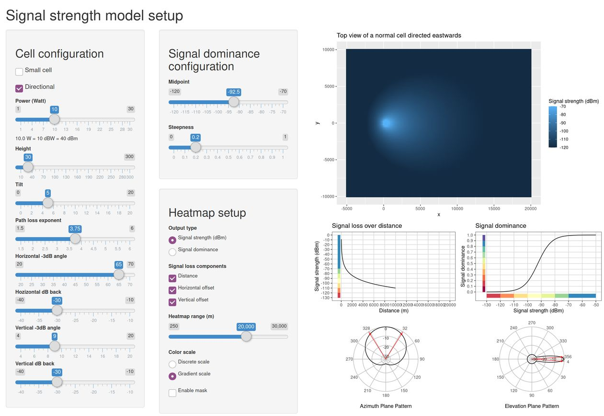

Explanation of mobloc
================

## Introduction

This document is to explain the implementation of the methods provided
in mobloc.

## Model parameters

In the table below, the model parameters are listed.

<table>
<thead>
<tr>
<th style="text-align:left;">
name
</th>
<th style="text-align:left;">
default
</th>
<th style="text-align:left;">
description
</th>
</tr>
</thead>
<tbody>
<tr>
<td style="text-align:left;">
W
</td>
<td style="text-align:left;">
10
</td>
<td style="text-align:left;">
default power in Watt of a normal cell (placed in a cell tower or
rooftop site)
</td>
</tr>
<tr>
<td style="text-align:left;">
W_small
</td>
<td style="text-align:left;">
5
</td>
<td style="text-align:left;">
default power in Watt of a small cell (omnidirectional)
</td>
</tr>
<tr>
<td style="text-align:left;">
ple
</td>
<td style="text-align:left;">
3.75
</td>
<td style="text-align:left;">
default path loss exponent
</td>
</tr>
<tr>
<td style="text-align:left;">
ple_small
</td>
<td style="text-align:left;">
6
</td>
<td style="text-align:left;">
path loss exponent for small cells
</td>
</tr>
<tr>
<td style="text-align:left;">
ple_0
</td>
<td style="text-align:left;">
3.5
</td>
<td style="text-align:left;">
path loss exponent for free space
</td>
</tr>
<tr>
<td style="text-align:left;">
ple_1
</td>
<td style="text-align:left;">
4
</td>
<td style="text-align:left;">
path loss exponent for dense environments
</td>
</tr>
<tr>
<td style="text-align:left;">
midpoint
</td>
<td style="text-align:left;">
-92.5
</td>
<td style="text-align:left;">
midpoint of the logistic function used to map signal strength to signal
dominance
</td>
</tr>
<tr>
<td style="text-align:left;">
steepness
</td>
<td style="text-align:left;">
0.2
</td>
<td style="text-align:left;">
steepness of the logistic function used to map signal strength to signal
dominance
</td>
</tr>
<tr>
<td style="text-align:left;">
range
</td>
<td style="text-align:left;">
10000
</td>
<td style="text-align:left;">
maximum range of normal cells
</td>
</tr>
<tr>
<td style="text-align:left;">
range_small
</td>
<td style="text-align:left;">
1000
</td>
<td style="text-align:left;">
maximum range of small cells
</td>
</tr>
<tr>
<td style="text-align:left;">
height
</td>
<td style="text-align:left;">
30
</td>
<td style="text-align:left;">
default height of normal cells
</td>
</tr>
<tr>
<td style="text-align:left;">
height_small
</td>
<td style="text-align:left;">
8
</td>
<td style="text-align:left;">
default height of small cells
</td>
</tr>
<tr>
<td style="text-align:left;">
tilt
</td>
<td style="text-align:left;">
5
</td>
<td style="text-align:left;">
default (horizontal) tilt. Only applicable for directional cells
</td>
</tr>
<tr>
<td style="text-align:left;">
beam_v
</td>
<td style="text-align:left;">
9
</td>
<td style="text-align:left;">
default vertical beam width. Only applicable for directional cells
</td>
</tr>
<tr>
<td style="text-align:left;">
beam_h
</td>
<td style="text-align:left;">
65
</td>
<td style="text-align:left;">
default horizontal beam width. Only applicable for directional cells
</td>
</tr>
<tr>
<td style="text-align:left;">
azim_dB_back
</td>
<td style="text-align:left;">
-30
</td>
<td style="text-align:left;">
difference in signal strength between front and back
</td>
</tr>
<tr>
<td style="text-align:left;">
elev_dB_back
</td>
<td style="text-align:left;">
-30
</td>
<td style="text-align:left;">
difference in signal strength between front and back
</td>
</tr>
<tr>
<td style="text-align:left;">
sig_d_th
</td>
<td style="text-align:left;">
0.005
</td>
<td style="text-align:left;">
signal dominance threshold
</td>
</tr>
<tr>
<td style="text-align:left;">
max_overlapping_cells
</td>
<td style="text-align:left;">
100
</td>
<td style="text-align:left;">
maximum number of cells that may overlap per raster tile. If the actual
number exceeds this parameter, the max_overlapping_cells cells with the
highest signal strength are selected
</td>
</tr>
<tr>
<td style="text-align:left;">
TA_step
</td>
<td style="text-align:left;">
78.12
</td>
<td style="text-align:left;">
meters that correspond to one Timing Advance (TA) step. This parameter
depends on the network technology and psychical properties such as air
pressure. In GSM networks it is approximately 554 meters, and LTE (4G)
networks 78.12 meters.
</td>
</tr>
<tr>
<td style="text-align:left;">
TA_max
</td>
<td style="text-align:left;">
1282
</td>
<td style="text-align:left;">
maximum Timing Advance (TA) value (integer). In other words, TA can have
a value between 0 and TA_max. In GSM it is 63, and in LTE 1282.
</td>
</tr>
<tr>
<td style="text-align:left;">
TA_buffer
</td>
<td style="text-align:left;">
1
</td>
<td style="text-align:left;">
buffer to prevent artifacts in the TA to grid tile conversion. These
artifacts occur when TA_step is similar or smaller than the width of a
grid tile. TA_buffer is an integer that determines the number of TA
steps that are added in front of behind the actual TA band.
</td>
</tr>
</tbody>
</table>

We explain how we use them below.

## Imputation of input data

Most of the parameters are used to impute missing physical properties.

An example of the complete input dataset of the ‘cell plan’ (cell
locations with physical properties) is the following:

<table class="table" style="font-size: 10px; margin-left: auto; margin-right: auto;">
<thead>
<tr>
<th style="text-align:left;">
cell
</th>
<th style="text-align:left;">
small
</th>
<th style="text-align:right;">
height
</th>
<th style="text-align:right;">
direction
</th>
<th style="text-align:right;">
tilt
</th>
<th style="text-align:right;">
beam_h
</th>
<th style="text-align:right;">
beam_v
</th>
<th style="text-align:left;">
geometry
</th>
<th style="text-align:right;">
x
</th>
<th style="text-align:right;">
y
</th>
<th style="text-align:right;">
z
</th>
<th style="text-align:right;">
W
</th>
<th style="text-align:right;">
range
</th>
<th style="text-align:right;">
ple
</th>
</tr>
</thead>
<tbody>
<tr>
<td style="text-align:left;">
BEE_150_N1
</td>
<td style="text-align:left;">
FALSE
</td>
<td style="text-align:right;">
20.36
</td>
<td style="text-align:right;">
110
</td>
<td style="text-align:right;">
3
</td>
<td style="text-align:right;">
65
</td>
<td style="text-align:right;">
7.5
</td>
<td style="text-align:left;">
POINT (4028177 3100291)
</td>
<td style="text-align:right;">
4028177
</td>
<td style="text-align:right;">
3100291
</td>
<td style="text-align:right;">
106.8767
</td>
<td style="text-align:right;">
10
</td>
<td style="text-align:right;">
10000
</td>
<td style="text-align:right;">
3.75
</td>
</tr>
<tr>
<td style="text-align:left;">
BEE_150_N2
</td>
<td style="text-align:left;">
FALSE
</td>
<td style="text-align:right;">
20.36
</td>
<td style="text-align:right;">
230
</td>
<td style="text-align:right;">
3
</td>
<td style="text-align:right;">
65
</td>
<td style="text-align:right;">
4.0
</td>
<td style="text-align:left;">
POINT (4028177 3100291)
</td>
<td style="text-align:right;">
4028177
</td>
<td style="text-align:right;">
3100291
</td>
<td style="text-align:right;">
106.8767
</td>
<td style="text-align:right;">
10
</td>
<td style="text-align:right;">
10000
</td>
<td style="text-align:right;">
3.75
</td>
</tr>
<tr>
<td style="text-align:left;">
BEE_150_N3
</td>
<td style="text-align:left;">
FALSE
</td>
<td style="text-align:right;">
20.36
</td>
<td style="text-align:right;">
350
</td>
<td style="text-align:right;">
3
</td>
<td style="text-align:right;">
65
</td>
<td style="text-align:right;">
4.0
</td>
<td style="text-align:left;">
POINT (4028177 3100291)
</td>
<td style="text-align:right;">
4028177
</td>
<td style="text-align:right;">
3100291
</td>
<td style="text-align:right;">
106.8767
</td>
<td style="text-align:right;">
10
</td>
<td style="text-align:right;">
10000
</td>
<td style="text-align:right;">
3.75
</td>
</tr>
<tr>
<td style="text-align:left;">
BEE_264_N1
</td>
<td style="text-align:left;">
FALSE
</td>
<td style="text-align:right;">
24.44
</td>
<td style="text-align:right;">
325
</td>
<td style="text-align:right;">
2
</td>
<td style="text-align:right;">
65
</td>
<td style="text-align:right;">
7.5
</td>
<td style="text-align:left;">
POINT (4025802 3100291)
</td>
<td style="text-align:right;">
4025802
</td>
<td style="text-align:right;">
3100291
</td>
<td style="text-align:right;">
103.8727
</td>
<td style="text-align:right;">
10
</td>
<td style="text-align:right;">
10000
</td>
<td style="text-align:right;">
3.75
</td>
</tr>
<tr>
<td style="text-align:left;">
BEE_264_N2
</td>
<td style="text-align:left;">
FALSE
</td>
<td style="text-align:right;">
24.44
</td>
<td style="text-align:right;">
55
</td>
<td style="text-align:right;">
2
</td>
<td style="text-align:right;">
65
</td>
<td style="text-align:right;">
7.5
</td>
<td style="text-align:left;">
POINT (4025802 3100291)
</td>
<td style="text-align:right;">
4025802
</td>
<td style="text-align:right;">
3100291
</td>
<td style="text-align:right;">
103.8727
</td>
<td style="text-align:right;">
10
</td>
<td style="text-align:right;">
10000
</td>
<td style="text-align:right;">
3.75
</td>
</tr>
<tr>
<td style="text-align:left;">
BEE_264_N3
</td>
<td style="text-align:left;">
FALSE
</td>
<td style="text-align:right;">
24.44
</td>
<td style="text-align:right;">
190
</td>
<td style="text-align:right;">
2
</td>
<td style="text-align:right;">
65
</td>
<td style="text-align:right;">
7.5
</td>
<td style="text-align:left;">
POINT (4025802 3100291)
</td>
<td style="text-align:right;">
4025802
</td>
<td style="text-align:right;">
3100291
</td>
<td style="text-align:right;">
103.8727
</td>
<td style="text-align:right;">
10
</td>
<td style="text-align:right;">
10000
</td>
<td style="text-align:right;">
3.75
</td>
</tr>
</tbody>
</table>

By ‘complete’ we mean that all variables are used by mobloc to compute
the signal strength. Variables that are relevant for the MNO data
processing but not used by mobloc, in particular date/time, can of
course be contained in this data, but will be ignored by mobloc.

The x and y variables are the coordinates according to the used CRS.
Latitude/longitude (WGS84) can be used, but for the calculation of
distances it is recommended to use a CRS where distances can be directly
derived from the CRS coordinates. (Distances can also be calculated
directly from lat/lon coordinates but this may be computationally
expensive.).

For the z variable, we use the following formula:
`z = elevation + height`. Elevation is the meters above sea level.
Height is the height of the cell from the ground. Therefore, z is the
meters of the cell above sea level. For the input data, either z or
height is required. Elevation is taken from an additional data source,
which contains all elevation values of the area of interest.

The only mandatory fields are “cell” (identifier), and “geometry” (the
location). The default parameters above are used to impute missing
variables/values. For instance, if the variable “direction” is missing,
all cells are considered onmidirectional. The variable “small” is only
used to select a different set of default values. These are the
parameters with the postfix “\_small”.

To illustrate the imputation of missing values, consider this input data
of 3 cells:

<table>
<thead>
<tr>
<th style="text-align:left;">
cell
</th>
<th style="text-align:left;">
small
</th>
<th style="text-align:left;">
geometry
</th>
</tr>
</thead>
<tbody>
<tr>
<td style="text-align:left;">
A
</td>
<td style="text-align:left;">
FALSE
</td>
<td style="text-align:left;">
POINT (4028177 3100291)
</td>
</tr>
<tr>
<td style="text-align:left;">
B
</td>
<td style="text-align:left;">
FALSE
</td>
<td style="text-align:left;">
POINT (4028177 3100291)
</td>
</tr>
<tr>
<td style="text-align:left;">
C
</td>
<td style="text-align:left;">
TRUE
</td>
<td style="text-align:left;">
POINT (4028177 3100291)
</td>
</tr>
</tbody>
</table>

The imputed data would be:

<table class="table" style="font-size: 10px; margin-left: auto; margin-right: auto;">
<thead>
<tr>
<th style="text-align:left;">
cell
</th>
<th style="text-align:left;">
small
</th>
<th style="text-align:left;">
geometry
</th>
<th style="text-align:right;">
x
</th>
<th style="text-align:right;">
y
</th>
<th style="text-align:right;">
height
</th>
<th style="text-align:right;">
z
</th>
<th style="text-align:left;">
direction
</th>
<th style="text-align:right;">
W
</th>
<th style="text-align:left;">
tilt
</th>
<th style="text-align:left;">
beam_h
</th>
<th style="text-align:left;">
beam_v
</th>
<th style="text-align:right;">
range
</th>
<th style="text-align:right;">
ple
</th>
</tr>
</thead>
<tbody>
<tr>
<td style="text-align:left;">
A
</td>
<td style="text-align:left;">
FALSE
</td>
<td style="text-align:left;">
POINT (4028177 3100291)
</td>
<td style="text-align:right;">
4028177
</td>
<td style="text-align:right;">
3100291
</td>
<td style="text-align:right;">
30
</td>
<td style="text-align:right;">
116.51673
</td>
<td style="text-align:left;">
NA
</td>
<td style="text-align:right;">
10
</td>
<td style="text-align:left;">
NA
</td>
<td style="text-align:left;">
NA
</td>
<td style="text-align:left;">
NA
</td>
<td style="text-align:right;">
10000
</td>
<td style="text-align:right;">
3.75
</td>
</tr>
<tr>
<td style="text-align:left;">
B
</td>
<td style="text-align:left;">
FALSE
</td>
<td style="text-align:left;">
POINT (4028177 3100291)
</td>
<td style="text-align:right;">
4028177
</td>
<td style="text-align:right;">
3100291
</td>
<td style="text-align:right;">
30
</td>
<td style="text-align:right;">
116.51673
</td>
<td style="text-align:left;">
NA
</td>
<td style="text-align:right;">
10
</td>
<td style="text-align:left;">
NA
</td>
<td style="text-align:left;">
NA
</td>
<td style="text-align:left;">
NA
</td>
<td style="text-align:right;">
10000
</td>
<td style="text-align:right;">
3.75
</td>
</tr>
<tr>
<td style="text-align:left;">
C
</td>
<td style="text-align:left;">
TRUE
</td>
<td style="text-align:left;">
POINT (4028177 3100291)
</td>
<td style="text-align:right;">
4028177
</td>
<td style="text-align:right;">
3100291
</td>
<td style="text-align:right;">
8
</td>
<td style="text-align:right;">
94.51673
</td>
<td style="text-align:left;">
NA
</td>
<td style="text-align:right;">
5
</td>
<td style="text-align:left;">
NA
</td>
<td style="text-align:left;">
NA
</td>
<td style="text-align:left;">
NA
</td>
<td style="text-align:right;">
1000
</td>
<td style="text-align:right;">
6.00
</td>
</tr>
</tbody>
</table>

Note that the imputed height of A and B is 30 meters, but for C (labeled
the small cell), it is 8.

Important to note is that all default values listed in the table with
parameters above, are determined during one collaboration project with
an MNO in the past. Other than face validity checks, these values have
not been validated. Therefore, we strongly recommend to carefully check
and if needed adjust the parameter values using the state-of-the-art
knowledge of MNO data.

The mobvis package contains an interactive tool (R-Shiny app) that can
be used to experiment with parameter settings. In R, it can be started
with:

``` r
 mobvis::setup_sig_strength_model()
```



## Signal strength computation
