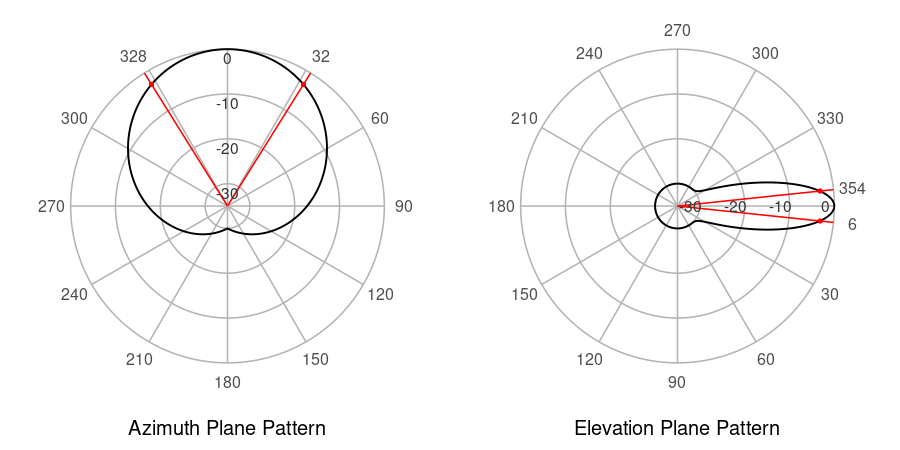
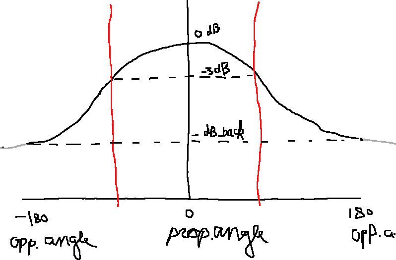

Explanation of mobloc
================

## Introduction

This document is to explain the implementation of the methods provided
in mobloc.

## Installing mobloc and mobvis

For reimplementing the methods, it could be useful to be able to run
mobloc and mobvis. These can be installed by running these two lines of
code in R:

``` r
devtools::install_github("MobilePhoneESSnetBigData/mobloc")
devtools::install_github("MobilePhoneESSnetBigData/mobvis")
```

The other document
<https://github.com/MobilePhoneESSnetBigData/mobloc/blob/master/tutorial/mobloc_vignette.md>
will explain mobloc and mobvis from a **user** persepective.

## Model parameters

In the table below, the model parameters are listed.

<table>
<thead>
<tr>
<th style="text-align:left;">
name
</th>
<th style="text-align:left;">
default
</th>
<th style="text-align:left;">
description
</th>
</tr>
</thead>
<tbody>
<tr>
<td style="text-align:left;">
W
</td>
<td style="text-align:left;">
10
</td>
<td style="text-align:left;">
default power in Watt of a normal cell (placed in a cell tower or
rooftop site)
</td>
</tr>
<tr>
<td style="text-align:left;">
W_small
</td>
<td style="text-align:left;">
5
</td>
<td style="text-align:left;">
default power in Watt of a small cell (omnidirectional)
</td>
</tr>
<tr>
<td style="text-align:left;">
ple
</td>
<td style="text-align:left;">
3.75
</td>
<td style="text-align:left;">
default path loss exponent
</td>
</tr>
<tr>
<td style="text-align:left;">
ple_small
</td>
<td style="text-align:left;">
6
</td>
<td style="text-align:left;">
path loss exponent for small cells
</td>
</tr>
<tr>
<td style="text-align:left;">
ple_0
</td>
<td style="text-align:left;">
3.5
</td>
<td style="text-align:left;">
path loss exponent for free space
</td>
</tr>
<tr>
<td style="text-align:left;">
ple_1
</td>
<td style="text-align:left;">
4
</td>
<td style="text-align:left;">
path loss exponent for dense environments
</td>
</tr>
<tr>
<td style="text-align:left;">
midpoint
</td>
<td style="text-align:left;">
-92.5
</td>
<td style="text-align:left;">
midpoint of the logistic function used to map signal strength to signal
dominance
</td>
</tr>
<tr>
<td style="text-align:left;">
steepness
</td>
<td style="text-align:left;">
0.2
</td>
<td style="text-align:left;">
steepness of the logistic function used to map signal strength to signal
dominance
</td>
</tr>
<tr>
<td style="text-align:left;">
range
</td>
<td style="text-align:left;">
10000
</td>
<td style="text-align:left;">
maximum range of normal cells
</td>
</tr>
<tr>
<td style="text-align:left;">
range_small
</td>
<td style="text-align:left;">
1000
</td>
<td style="text-align:left;">
maximum range of small cells
</td>
</tr>
<tr>
<td style="text-align:left;">
height
</td>
<td style="text-align:left;">
30
</td>
<td style="text-align:left;">
default height of normal cells
</td>
</tr>
<tr>
<td style="text-align:left;">
height_small
</td>
<td style="text-align:left;">
8
</td>
<td style="text-align:left;">
default height of small cells
</td>
</tr>
<tr>
<td style="text-align:left;">
tilt
</td>
<td style="text-align:left;">
5
</td>
<td style="text-align:left;">
default (horizontal) tilt. Only applicable for directional cells
</td>
</tr>
<tr>
<td style="text-align:left;">
beam_v
</td>
<td style="text-align:left;">
9
</td>
<td style="text-align:left;">
default vertical beam width. Only applicable for directional cells
</td>
</tr>
<tr>
<td style="text-align:left;">
beam_h
</td>
<td style="text-align:left;">
65
</td>
<td style="text-align:left;">
default horizontal beam width. Only applicable for directional cells
</td>
</tr>
<tr>
<td style="text-align:left;">
azim_dB_back
</td>
<td style="text-align:left;">
-30
</td>
<td style="text-align:left;">
difference in signal strength between front and back
</td>
</tr>
<tr>
<td style="text-align:left;">
elev_dB_back
</td>
<td style="text-align:left;">
-30
</td>
<td style="text-align:left;">
difference in signal strength between front and back
</td>
</tr>
<tr>
<td style="text-align:left;">
sig_d_th
</td>
<td style="text-align:left;">
0.005
</td>
<td style="text-align:left;">
signal dominance threshold
</td>
</tr>
<tr>
<td style="text-align:left;">
max_overlapping_cells
</td>
<td style="text-align:left;">
100
</td>
<td style="text-align:left;">
maximum number of cells that may overlap per raster tile. If the actual
number exceeds this parameter, the max_overlapping_cells cells with the
highest signal strength are selected
</td>
</tr>
<tr>
<td style="text-align:left;">
TA_step
</td>
<td style="text-align:left;">
78.12
</td>
<td style="text-align:left;">
meters that correspond to one Timing Advance (TA) step. This parameter
depends on the network technology and psychical properties such as air
pressure. In GSM networks it is approximately 554 meters, and LTE (4G)
networks 78.12 meters.
</td>
</tr>
<tr>
<td style="text-align:left;">
TA_max
</td>
<td style="text-align:left;">
1282
</td>
<td style="text-align:left;">
maximum Timing Advance (TA) value (integer). In other words, TA can have
a value between 0 and TA_max. In GSM it is 63, and in LTE 1282.
</td>
</tr>
<tr>
<td style="text-align:left;">
TA_buffer
</td>
<td style="text-align:left;">
1
</td>
<td style="text-align:left;">
buffer to prevent artifacts in the TA to grid tile conversion. These
artifacts occur when TA_step is similar or smaller than the width of a
grid tile. TA_buffer is an integer that determines the number of TA
steps that are added in front of behind the actual TA band.
</td>
</tr>
</tbody>
</table>

We explain how we use them below.

## Imputation of input data

Most of the parameters are used to impute missing physical properties.

An example of the complete input dataset of the ‘cell plan’ (cell
locations with physical properties) is the following:

<table class="table" style="font-size: 10px; margin-left: auto; margin-right: auto;">
<thead>
<tr>
<th style="text-align:left;">
cell
</th>
<th style="text-align:left;">
small
</th>
<th style="text-align:right;">
height
</th>
<th style="text-align:right;">
direction
</th>
<th style="text-align:right;">
tilt
</th>
<th style="text-align:right;">
beam_h
</th>
<th style="text-align:right;">
beam_v
</th>
<th style="text-align:left;">
geometry
</th>
<th style="text-align:right;">
x
</th>
<th style="text-align:right;">
y
</th>
<th style="text-align:right;">
z
</th>
<th style="text-align:right;">
W
</th>
<th style="text-align:right;">
range
</th>
<th style="text-align:right;">
ple
</th>
</tr>
</thead>
<tbody>
<tr>
<td style="text-align:left;">
BEE_150_N1
</td>
<td style="text-align:left;">
FALSE
</td>
<td style="text-align:right;">
20.36
</td>
<td style="text-align:right;">
110
</td>
<td style="text-align:right;">
3
</td>
<td style="text-align:right;">
65
</td>
<td style="text-align:right;">
7.5
</td>
<td style="text-align:left;">
POINT (4028177 3100291)
</td>
<td style="text-align:right;">
4028177
</td>
<td style="text-align:right;">
3100291
</td>
<td style="text-align:right;">
106.8767
</td>
<td style="text-align:right;">
10
</td>
<td style="text-align:right;">
10000
</td>
<td style="text-align:right;">
3.75
</td>
</tr>
<tr>
<td style="text-align:left;">
BEE_150_N2
</td>
<td style="text-align:left;">
FALSE
</td>
<td style="text-align:right;">
20.36
</td>
<td style="text-align:right;">
230
</td>
<td style="text-align:right;">
3
</td>
<td style="text-align:right;">
65
</td>
<td style="text-align:right;">
4.0
</td>
<td style="text-align:left;">
POINT (4028177 3100291)
</td>
<td style="text-align:right;">
4028177
</td>
<td style="text-align:right;">
3100291
</td>
<td style="text-align:right;">
106.8767
</td>
<td style="text-align:right;">
10
</td>
<td style="text-align:right;">
10000
</td>
<td style="text-align:right;">
3.75
</td>
</tr>
<tr>
<td style="text-align:left;">
BEE_150_N3
</td>
<td style="text-align:left;">
FALSE
</td>
<td style="text-align:right;">
20.36
</td>
<td style="text-align:right;">
350
</td>
<td style="text-align:right;">
3
</td>
<td style="text-align:right;">
65
</td>
<td style="text-align:right;">
4.0
</td>
<td style="text-align:left;">
POINT (4028177 3100291)
</td>
<td style="text-align:right;">
4028177
</td>
<td style="text-align:right;">
3100291
</td>
<td style="text-align:right;">
106.8767
</td>
<td style="text-align:right;">
10
</td>
<td style="text-align:right;">
10000
</td>
<td style="text-align:right;">
3.75
</td>
</tr>
<tr>
<td style="text-align:left;">
BEE_264_N1
</td>
<td style="text-align:left;">
FALSE
</td>
<td style="text-align:right;">
24.44
</td>
<td style="text-align:right;">
325
</td>
<td style="text-align:right;">
2
</td>
<td style="text-align:right;">
65
</td>
<td style="text-align:right;">
7.5
</td>
<td style="text-align:left;">
POINT (4025802 3100291)
</td>
<td style="text-align:right;">
4025802
</td>
<td style="text-align:right;">
3100291
</td>
<td style="text-align:right;">
103.8727
</td>
<td style="text-align:right;">
10
</td>
<td style="text-align:right;">
10000
</td>
<td style="text-align:right;">
3.75
</td>
</tr>
<tr>
<td style="text-align:left;">
BEE_264_N2
</td>
<td style="text-align:left;">
FALSE
</td>
<td style="text-align:right;">
24.44
</td>
<td style="text-align:right;">
55
</td>
<td style="text-align:right;">
2
</td>
<td style="text-align:right;">
65
</td>
<td style="text-align:right;">
7.5
</td>
<td style="text-align:left;">
POINT (4025802 3100291)
</td>
<td style="text-align:right;">
4025802
</td>
<td style="text-align:right;">
3100291
</td>
<td style="text-align:right;">
103.8727
</td>
<td style="text-align:right;">
10
</td>
<td style="text-align:right;">
10000
</td>
<td style="text-align:right;">
3.75
</td>
</tr>
<tr>
<td style="text-align:left;">
BEE_264_N3
</td>
<td style="text-align:left;">
FALSE
</td>
<td style="text-align:right;">
24.44
</td>
<td style="text-align:right;">
190
</td>
<td style="text-align:right;">
2
</td>
<td style="text-align:right;">
65
</td>
<td style="text-align:right;">
7.5
</td>
<td style="text-align:left;">
POINT (4025802 3100291)
</td>
<td style="text-align:right;">
4025802
</td>
<td style="text-align:right;">
3100291
</td>
<td style="text-align:right;">
103.8727
</td>
<td style="text-align:right;">
10
</td>
<td style="text-align:right;">
10000
</td>
<td style="text-align:right;">
3.75
</td>
</tr>
</tbody>
</table>

By ‘complete’ we mean that all variables are used by mobloc to compute
the signal strength. Variables that are relevant for the MNO data
processing but not used by mobloc, in particular date/time, can of
course be contained in this data, but will be ignored by mobloc.

The x and y variables are the coordinates according to the used CRS.
Latitude/longitude (WGS84) can be used, but for the calculation of
distances it is recommended to use a CRS where distances can be directly
derived from the CRS coordinates. (Distances can also be calculated
directly from lat/lon coordinates but this may be computationally
expensive.).

For the z variable, we use the following formula:
`z = elevation + height`. Elevation is the meters above sea level.
Height is the height of the cell from the ground. Therefore, z is the
meters of the cell above sea level. For the input data, either z or
height is required. Elevation is taken from an additional data source,
which contains all elevation values of the area of interest.

The only mandatory fields are “cell” (identifier), and “geometry” (the
location). The default parameters above are used to impute missing
variables/values. For instance, if the variable “direction” is missing,
all cells are considered onmidirectional. The variable “small” is only
used to select a different set of default values. These are the
parameters with the postfix “\_small”.

To illustrate the imputation of missing values, consider this input data
of 3 cells:

<table>
<thead>
<tr>
<th style="text-align:left;">
cell
</th>
<th style="text-align:left;">
small
</th>
<th style="text-align:left;">
geometry
</th>
</tr>
</thead>
<tbody>
<tr>
<td style="text-align:left;">
A
</td>
<td style="text-align:left;">
FALSE
</td>
<td style="text-align:left;">
POINT (4028177 3100291)
</td>
</tr>
<tr>
<td style="text-align:left;">
B
</td>
<td style="text-align:left;">
FALSE
</td>
<td style="text-align:left;">
POINT (4028177 3100291)
</td>
</tr>
<tr>
<td style="text-align:left;">
C
</td>
<td style="text-align:left;">
TRUE
</td>
<td style="text-align:left;">
POINT (4028177 3100291)
</td>
</tr>
</tbody>
</table>

The imputed data would be:

<table class="table" style="font-size: 10px; margin-left: auto; margin-right: auto;">
<thead>
<tr>
<th style="text-align:left;">
cell
</th>
<th style="text-align:left;">
small
</th>
<th style="text-align:left;">
geometry
</th>
<th style="text-align:right;">
x
</th>
<th style="text-align:right;">
y
</th>
<th style="text-align:right;">
height
</th>
<th style="text-align:right;">
z
</th>
<th style="text-align:left;">
direction
</th>
<th style="text-align:right;">
W
</th>
<th style="text-align:left;">
tilt
</th>
<th style="text-align:left;">
beam_h
</th>
<th style="text-align:left;">
beam_v
</th>
<th style="text-align:right;">
range
</th>
<th style="text-align:right;">
ple
</th>
</tr>
</thead>
<tbody>
<tr>
<td style="text-align:left;">
A
</td>
<td style="text-align:left;">
FALSE
</td>
<td style="text-align:left;">
POINT (4028177 3100291)
</td>
<td style="text-align:right;">
4028177
</td>
<td style="text-align:right;">
3100291
</td>
<td style="text-align:right;">
30
</td>
<td style="text-align:right;">
116.51673
</td>
<td style="text-align:left;">
NA
</td>
<td style="text-align:right;">
10
</td>
<td style="text-align:left;">
NA
</td>
<td style="text-align:left;">
NA
</td>
<td style="text-align:left;">
NA
</td>
<td style="text-align:right;">
10000
</td>
<td style="text-align:right;">
3.75
</td>
</tr>
<tr>
<td style="text-align:left;">
B
</td>
<td style="text-align:left;">
FALSE
</td>
<td style="text-align:left;">
POINT (4028177 3100291)
</td>
<td style="text-align:right;">
4028177
</td>
<td style="text-align:right;">
3100291
</td>
<td style="text-align:right;">
30
</td>
<td style="text-align:right;">
116.51673
</td>
<td style="text-align:left;">
NA
</td>
<td style="text-align:right;">
10
</td>
<td style="text-align:left;">
NA
</td>
<td style="text-align:left;">
NA
</td>
<td style="text-align:left;">
NA
</td>
<td style="text-align:right;">
10000
</td>
<td style="text-align:right;">
3.75
</td>
</tr>
<tr>
<td style="text-align:left;">
C
</td>
<td style="text-align:left;">
TRUE
</td>
<td style="text-align:left;">
POINT (4028177 3100291)
</td>
<td style="text-align:right;">
4028177
</td>
<td style="text-align:right;">
3100291
</td>
<td style="text-align:right;">
8
</td>
<td style="text-align:right;">
94.51673
</td>
<td style="text-align:left;">
NA
</td>
<td style="text-align:right;">
5
</td>
<td style="text-align:left;">
NA
</td>
<td style="text-align:left;">
NA
</td>
<td style="text-align:left;">
NA
</td>
<td style="text-align:right;">
1000
</td>
<td style="text-align:right;">
6.00
</td>
</tr>
</tbody>
</table>

Note that the imputed height of A and B is 30 meters, but for C (labeled
the small cell), it is 8.

Important to note is that all default values listed in the table with
parameters above, are determined during one collaboration project with
an MNO in the past. Other than face validity checks, these values have
not been validated. Therefore, we strongly recommend to carefully check
and if needed adjust the parameter values using the state-of-the-art
knowledge of MNO data.

The mobvis package contains an interactive tool (R-Shiny app) that can
be used to experiment with parameter settings. In R, it can be started
with:

``` r
 mobvis::setup_sig_strength_model()
```


## Signal strength computation

The signal strength is computed via the function `compute_sig_strength`.
This function does the administrative part (e.g. checking input datasets
and setting up parallel processes) around the core function
`signal_strength`. This administrative part is R-specific so is less
relevant when implementing in another language. Therefore, we focus on
the function `signal_strength`.

The source code should be easy to understand for people with an IT
background:
<https://github.com/MobilePhoneESSnetBigData/mobloc/blob/master/R/signal_strength.R>
. Some R-specific knowledge helpful to understand R scripts:

- The \#’ block above each function is the documentation in roxygen2
  format (see
  <https://cran.r-project.org/web/packages/roxygen2/vignettes/roxygen2.html>).
  When an R package is build, it will be compiled to an HTML help page.
  In R, `?signal_strength` will show this page.
- The odd `<-` operator is the assignment, which is normally (in other
  programming languages) the `=` operator.

About content of the signal strength function. This function computes
the signal strength for a set of grid tiles (for which the centroids are
stored in the input argument `co`) for one specific cell, specified with
the coordinates `cx`, `cy`, `cz` (as mentioned before, when using a
projected CRS instead of lat/lon coordinates, the coordinates represent
meters, which make distance calculations much easier/faster), and the
physical properties `direction`, `tilt`, `beam_h`, `beam_v`, and `W`.

The signal strength consists of three components (which can be turned on
and off via the input argument `enabled`):

### `"d"` Distance

Signal strength decreases with distance. The path loss exponent (`ple`)
determines to which extend. This is mainly determined by the environment
of the cell: 2 can be used for free space, 4 for urban areas, and 6 for
buildings. The function to compute this called in
<https://github.com/MobilePhoneESSnetBigData/mobloc/blob/master/R/signal_strength.R#L229>

For omnidirectional cells only the `"d"` component is needed. For
directional cells all three components.

### `"h"` and `"v"` Radiation pattern

Signal strength is also reduced if target location (where the device is)
differs from propagation angle, which is composed of the azimuth angle
(the hozinontal plane, `"h"`) and the elevation angle (the vertical
plane, `"v"`). We model the radiation patterns as Gaussian
distributions:



There are two input parameters that are relevant here: `azim_dB_back`
and `elev_dB_back`. These contain the dB difference between the
propagation direction and opposite direction (the ‘back’) in both
planes. By default both are -30dB, which mean that the signal strength
is 30dB weaker in the opposite ‘back’ direction. This can be seen in the
radiation plots. On the left hand side, (horizontal/azimuth plane) the
main propagation direction is upwards where the black line crosses the
radial axis at 0dB. In the downward direction, the black line crosses
the radial axis at the -30dB gridline. On the right hand side, the main
propagation is to the right (where the black line crosses 0dB) and the
opposite direction is to the left (-30dB).

The azimuth and elevation angles correspond to the angles in which the
signal strength is reduced by 3dB. These angles are depicted above by
the red lines.

The implementation is here:
<https://github.com/MobilePhoneESSnetBigData/mobloc/blob/master/R/signal_strength.R#L235-L251>
and
<https://github.com/MobilePhoneESSnetBigData/mobloc/blob/master/R/signal_strength.R#L255-L261>.
It is hard to explain adnd understand this implementation line by line.
Instead, it is easier to explain this implementation with the following
picture:



The aim is to fit this Gaussian curve twice, so once for the
azimuth/horizontal plane and once for the elevation/vertical plane. The
x-axis stands for propagation angle, where 0 means the main propagation
angle and (-)180 the opposite. The y-axis stands for dB difference with
respect to the main angle. There is no difference with x=0, so that is
the y=0dB point. The fit of the Gaussian curve depends on on two
variables, namely the (azimuth or elevation) angle (vertical red lines)
and the `dB_back` parameter (bottom horizontal dashed line).

There are several ways how this can be implemented. In the R
implementation, the function `attach_mapping` creates a lookup-table
that calculates the required standard deviations given the `db_back`
parameter, for each (azimuth/elevation) degree:

<table class="table" style="font-size: 10px; margin-left: auto; margin-right: auto;">
<thead>
<tr>
<th style="text-align:right;">
deg
</th>
<th style="text-align:right;">
sd
</th>
</tr>
</thead>
<tbody>
<tr>
<td style="text-align:right;">
1
</td>
<td style="text-align:right;">
1.98
</td>
</tr>
<tr>
<td style="text-align:right;">
2
</td>
<td style="text-align:right;">
4.14
</td>
</tr>
<tr>
<td style="text-align:right;">
3
</td>
<td style="text-align:right;">
6.30
</td>
</tr>
<tr>
<td style="text-align:right;">
4
</td>
<td style="text-align:right;">
8.46
</td>
</tr>
<tr>
<td style="text-align:right;">
5
</td>
<td style="text-align:right;">
10.80
</td>
</tr>
<tr>
<td style="text-align:right;">
6
</td>
<td style="text-align:right;">
12.96
</td>
</tr>
<tr>
<td style="text-align:right;">
7
</td>
<td style="text-align:right;">
15.12
</td>
</tr>
<tr>
<td style="text-align:right;">
8
</td>
<td style="text-align:right;">
17.28
</td>
</tr>
<tr>
<td style="text-align:right;">
9
</td>
<td style="text-align:right;">
19.44
</td>
</tr>
<tr>
<td style="text-align:right;">
10
</td>
<td style="text-align:right;">
21.60
</td>
</tr>
</tbody>
</table>
<table class="table" style="font-size: 10px; margin-left: auto; margin-right: auto;">
<thead>
<tr>
<th style="text-align:left;">
</th>
<th style="text-align:right;">
deg
</th>
<th style="text-align:right;">
sd
</th>
</tr>
</thead>
<tbody>
<tr>
<td style="text-align:left;">
171
</td>
<td style="text-align:right;">
171
</td>
<td style="text-align:right;">
179.1
</td>
</tr>
<tr>
<td style="text-align:left;">
172
</td>
<td style="text-align:right;">
172
</td>
<td style="text-align:right;">
179.1
</td>
</tr>
<tr>
<td style="text-align:left;">
173
</td>
<td style="text-align:right;">
173
</td>
<td style="text-align:right;">
179.1
</td>
</tr>
<tr>
<td style="text-align:left;">
174
</td>
<td style="text-align:right;">
174
</td>
<td style="text-align:right;">
179.1
</td>
</tr>
<tr>
<td style="text-align:left;">
175
</td>
<td style="text-align:right;">
175
</td>
<td style="text-align:right;">
179.1
</td>
</tr>
<tr>
<td style="text-align:left;">
176
</td>
<td style="text-align:right;">
176
</td>
<td style="text-align:right;">
179.1
</td>
</tr>
<tr>
<td style="text-align:left;">
177
</td>
<td style="text-align:right;">
177
</td>
<td style="text-align:right;">
179.1
</td>
</tr>
<tr>
<td style="text-align:left;">
178
</td>
<td style="text-align:right;">
178
</td>
<td style="text-align:right;">
179.1
</td>
</tr>
<tr>
<td style="text-align:left;">
179
</td>
<td style="text-align:right;">
179
</td>
<td style="text-align:right;">
179.1
</td>
</tr>
<tr>
<td style="text-align:left;">
180
</td>
<td style="text-align:right;">
180
</td>
<td style="text-align:right;">
179.1
</td>
</tr>
</tbody>
</table>

This is a one-time operation (provided that `dB_back` is fixed). The
function `find_sd` will find the standard deviation for which the
(amimuth/elevation) angle is closest to `deg` in this lookup-table.

## Calculation of signal dominance

The logistic function to compute the signal dominance is `db2s`
(<https://github.com/MobilePhoneESSnetBigData/mobloc/blob/master/R/signal_strength.R#L169>).

## Calculation of cell connection (in mobloc called ‘likelihood’) probabilities

This is straightforward. The implementation is very R-specific, so not
usable for other programming languages.

## Calculation of posterior probabilities

This is straightforward. The implementation is very R-specific, so not
usable for other programming languages.
