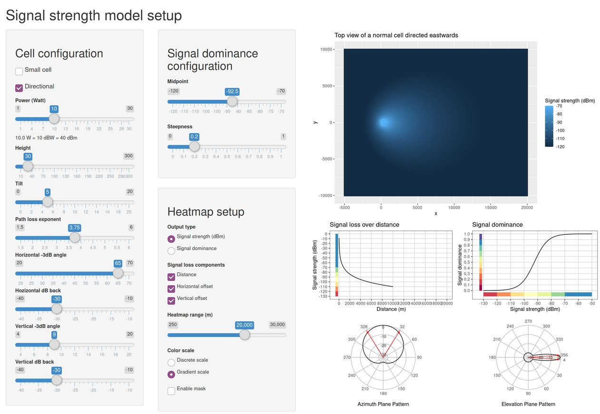

Introduction to mobloc, an R package for mobile location algorithms and
tools
================

## Introduction

Mobile phone network data is data generated by the network of cells
owned by a mobile network operator (MNO). The MNO facilitates mobile
communication and charges the corresponding costs to its customers. Most
countries have more than one MNO, each of whom owns and maintains their
own network of cells.

The data that is stored by the network is called signalling data. For
each mobile device that is connected to the network, it contains records
about active mobile phone use and about movement across the network.
Network data that contains records about calls, SMS messages, and mobile
data use are called Call Detail Records (CDR) or Data Detail Records
(DDR) and are used for billing. Signalling data and CDR/DDR have an
international standard.

Signalling data do not contain the exact geographic location of the
logged events. Instead, only the id numbers of the cells are included.
In mobile phone network technology, a *cell* enables mobile
communication for a specific area. Often, people confuse cells with
*antennas*, but these are not the same: an antenna may contain multiple
cells.

The `mobloc` package contains a set of tools to approximate the location
of mobile phone devices. This approximation is not a pinpoint location,
but a spatial distribution of locations.

The methods used in mobloc\`\` follow a Bayesian framework. We consider
three modules:

- Location prior. This is a priori information about where devices are
  expected to be. Any additional data source can be used, such as land
  use.
- Connection likelihood. This is an estimation of the probabilities of
  the connected cell, given the location. In `mobloc` two likelihoods
  are implemented: Voronoi and signal strength. The former is often used
  in literature, the latter is our alternative. For this likelihood,
  signal strength of the cells is modelled using physical properties of
  the cells. The likelihood also takes overlap of coverage areas of
  cells into account.
- Location posterior. This is the estimation of the spatial distribution
  of a device, given the cell.
- Timing advance. This is a Bayesian update on the location posterior
  using Timing Advance, a variable in the signalling data which
  indicates the distance between the cell and the device.

*Best Server Maps* (BSM) cannot be used as a source, but they can be
used for validation. The `mobloc` package models BSM, which can be
compared to the BSM of the MNO.

The methods are described in much more detail in \[1\].

The graphical user interfaces and visualization functions are
implemented in the package **mobvis** \[2\]. Installation of this
package is required to run this vignette.

## Setup signal strength model parameters

The first step to approximate the geographic locations, is to determine
the parameters for the signal propagation model. The default parameters
can be loaded with the function `mobloc_param`. The result is a standard
list:

``` r
ZL_param <- mobloc_param()
```

A short description of the parameters is provided in the documentation
of `mobloc_param`. These parameters are used to model the signal
strength. Most parameters are default values for parameters that are
often unknown. For imputing unknown parameters, we consider two types of
cells: normal cells, which are typically placed in cell towers or on
roof tops, and small cells, which are often placed indoors or in dense
urban areas (e.g. on street lights). Since these two types of cells have
very different characteristics, they also have different default values.
E.g. the power of a normal cell is set to 10 Watt for normal cells and 5
Watt for small cells.

Most of the parameters are used for the signal strength model, which is
used to create the signal strength likelihood. The `mobvis` package
contains a tool in which these parameters can be tuned. This tool is
started as follows:

``` r
setup_sig_strength_model()
```



This tool shows the signal strength model for one cell. The left hand
side panel shows the settings, which are by default set to values of the
list we just created with `mobloc_param`. When *small cell* is ticked,
the `_small` arguments are used as default values. The plots on the
right hand side show the propagation results. The heatmap on the top
right shows the top view of the signal strength of the cell. For
directed cells, the direction in this plot is east.

The four plots below the heatmap describe:

- The top left line diagram shows the signal loss as a function of the
  distance. The parameters that influence this are the cell power (`W`)
  and the path loss exponent (`ple`), which reflects the environment of
  the cell: 2 can be used for free space, 4 for urban areas, and 6 for
  buildings.
- The top right line diagram shows the signal quality as a function of
  the signal strength in dBm. It can be interpreted as the quality of
  connection, based on the assumption that for a mobile phone network,
  it is not important whether the connection is good (say -90 dBm) or
  extreme good (say -70 dBm). Instead, load balancing is much more
  important when there are multiple cells to choose from. Therefore, we
  applied a logistic function on the signal strength to flatten both
  tails. This function can be adjusted with the parameters `midpoint`
  and `steepness`.
- The bottom two plots illustrate the radiation pattern in the
  horizontal/azimuth plane the the vertical/elevation plane. The black
  contour lines indicate the signal loss as a function of the offset
  angle. The red points are the -3dB points, i.e. the angle at which the
  signal loss is 3 dB. These radiation plots can also be generated
  directly in R with the function `radiation_plot`. The parameters
  `beam_v`, `azim_dB_back`, `beam_h`, and `elev_dB_back` have influence
  on these radiation pattern.

## Loading artificial cellplan data

When the parameters have been set, the model can be applied to cellplan
data. To illustrate the model, we included artificial data to this
package. This data can be loaded as follows:

``` r
data("ZL_cellplan", "ZL_muni", "ZL_elevation", "ZL_landuse")
```

It is artifical cellplan data from the NUTS3 region Zuid-Limburg, the
most southern part of the Netherlands, which is roughly 30 by 30
kilometres large.

The object `ZL_cellplan` is an `sf` object (see packge `sf`) that
contains all the geopgraphic locations of the cells and the metadata.

``` r
ZL_cellplan
```

    ## Simple feature collection with 631 features and 7 fields
    ## Geometry type: POINT
    ## Dimension:     XY
    ## Bounding box:  xmin: 4014474 ymin: 3081174 xmax: 4045586 ymax: 3113448
    ## Projected CRS: ETRS89-extended / LAEA Europe
    ## First 10 features:
    ##          cell small height direction tilt beam_h beam_v                geometry
    ## 1  BEE_150_N1 FALSE  20.36       110    3     65    7.5 POINT (4028177 3100291)
    ## 2  BEE_150_N2 FALSE  20.36       230    3     65    4.0 POINT (4028177 3100291)
    ## 3  BEE_150_N3 FALSE  20.36       350    3     65    4.0 POINT (4028177 3100291)
    ## 4  BEE_264_N1 FALSE  24.44       325    2     65    7.5 POINT (4025802 3100291)
    ## 5  BEE_264_N2 FALSE  24.44        55    2     65    7.5 POINT (4025802 3100291)
    ## 6  BEE_264_N3 FALSE  24.44       190    2     65    7.5 POINT (4025802 3100291)
    ## 7  BEE_646_S1  TRUE   9.83        NA   NA     NA     NA POINT (4024858 3098099)
    ## 8  BEE_794_N1 FALSE  23.09       165   14     65    4.0 POINT (4025612 3101735)
    ## 9  BEE_794_N2 FALSE  23.09       260   14     65   14.0 POINT (4025612 3101735)
    ## 10 BEE_794_N3 FALSE  23.09        25   14     65    9.0 POINT (4025612 3101735)

The object `ZL_land` is a large multipolygon that defines the area. The
object `ZL_elevation` is a `raster` object that contains the elevation
heigths at 100 by 100 metre detail.

These example data can be plot with the `tmap` package

``` r
library(tmap)
tmap_mode("view")
qtm(ZL_elevation) + qtm(ZL_muni, fill=NULL) + qtm(ZL_cellplan)
```


The object `ZL_landuse` is a raster object that contains fractions of
land that is used for several categories. We will use this information
later on to determine the level of urbanization per cell and to define
prior information.

``` r
ZL_envir <- combine_raster_layers(ZL_landuse, weights = c(1, 1, 1, 0, 0)) 
```

The function `validate_cellplan` should be used to validate the
cellplan. It checks if required variables are present. Variables that
are not required as input, but needed for further analysis are imputed.
For instance, if `tilt` is missing, it is imputed by the default value
`ZL_param$tilt`.

``` r
ZL_cellplan <- validate_cellplan(ZL_cellplan, param = ZL_param, region = ZL_muni, envir = ZL_envir, elevation = ZL_elevation)
```

    ## Variable 'W' is missing. These have been imputed with the parameters 'W' and 'W_small' for normal and small cells respectively.

    ## Variable 'range' is missing. These have been imputed with the parameters 'range' and 'range_small' for normal and small cells respectively.

    ## Path loss exponent ('ple') values updated with envir object

    ## The cellplan has been made valid

The corresponding bounding box of Zuid-Limburg is created as follows.

``` r
library(sf)
```

    ## Linking to GEOS 3.11.0, GDAL 3.5.3, PROJ 9.1.0; sf_use_s2() is TRUE

``` r
ZL_bbox <- st_bbox(c(xmin = 4012000, ymin = 3077000, xmax = 4048000, ymax = 3117000), crs = st_crs(3035))
```

## Modelling the signal strength

In the next stage, the signal strength propagation is modeled. This is
done with rasterization, i.e. all spatial objects are transformed into
small tiles, e.g. of 100 by 100 meters. This is mainly done for
computational reasons. The raster is created as follows:

``` r
# create a raster of 100 by 100 meter cells
ZL_raster <- create_raster(ZL_bbox)
```

This object is a `raster` object that contains the raster id values,
which are numbered from top left to bottom right row-wise.

For each tile $g$ and cell $a$ where $g$ intersects with the polygon of
$a$, the following variables are computed: the distance, the modeled
signal strength, the relative signal strength, and the likelihood value.
The function for these calculations, called `process_cellplan`, supports
parallel computing. A parallel cluster can be created as follows:

``` r
# create a parallel cluster
require(parallel)
require(doParallel)
ncores <- detectCores()
cl <- makeCluster(ncores)
registerDoParallel(cl)
```

Note that it is not required to create a parallel cluster in order to
process the cellplan. It is recommended for large cellplans since it
reduced the computation time significantly.

``` r
# calculate probabilities
ZL_strength <- compute_sig_strength(cp = ZL_cellplan, raster = ZL_raster,
    elevation = ZL_elevation, param = ZL_param)
```

The result is a `data.frame` that contains information about the
modelled propagation (that is where the abbreviation `prop` stands for).
It has the following columns:

- `Cell_name` The identification numbers or names of the cells.
- `rid` tile id number. These are numbered according to the cells of
  specified raster object, in our example `ZL_raster`. The first number
  corresponds to the top left cell, and the sequence of numbers is
  row-wise.
- `dist` Distance from the cell location to the center of the tile.
- `dBm` Signal strength in dBm.
- `s` The signal dominance.

## Mobile location approximation

### Prior

In this example, we propose three priors:

- A uniform prior. In this prior, every tile has the same prior
  probability. So no additional information is used.
- A network prior. The cells are not placed without reason: an MNO
  (mobile network operator) will probably place more cells in dense
  areas. This information can be seen as prior information. We will
  extract this information from the propagation model.
- A land use prior. The prior probability depends on the land use. The
  general philosophy behind this approach is that in urban areas, it is
  more likely to espect people than in rural areas. In the example
  below, we create a weigthed prior, in which we assign a weight per
  land use category.

``` r
ZL_uniform_prior <- create_uniform_prior(ZL_raster)
ZL_network_prior <- create_network_prior(ZL_strength, ZL_raster)
ZL_landuse_prior <- create_prior(ZL_landuse, weights = c(1, 1, .1, 0, .5))
```

Since each of the previous priors have pros and cons, it may be
worthwile to create a composite prior in order to find good balance. In
this example we use the network prior for `25%` and the land use prior
for `75%`.

``` r
ZL_comp_prior <- create_prior(ZL_network_prior, ZL_landuse_prior, weights = c(.25, .75))
```

The result can be visualized using `tmap`:

``` r
qtm(ZL_comp_prior)
```


### Likelihood

The following functions create likelihoods based on the signal strength
model above, and, for reference, on the Voronoi tessellation:

``` r
ZL_strength_llh <- create_strength_llh(ZL_strength, param = ZL_param)
ZL_voronoi_llh <- create_voronoi_llh(ZL_cellplan, ZL_raster)
```

The variable in these data `pag` is the probability that a certain cell
is used given that the device is located in a certain the tile.

### Posterior

The posterior distribution `P(g|a`), can be calculated as follows:

``` r
ZL_post <- calculate_posterior(prior = ZL_comp_prior, llh = ZL_strength_llh, raster = ZL_raster)
```

When timing advance (TA) is available, the posterior can be updated
using TA bands. The parameters, such as the width of the TA bands, are
configured in the parameters of mobloc. The posterior distribution can
be updated (through a Bayesian update) with TA as follows:

``` r
ZL_post_TA <- update_posterior_TA(ZL_post, ZL_raster, ZL_cellplan, ZL_param, ZL_elevation)
```

### Exploration tool

The following tool from the `mobvis` package is used to explore the
results:

``` r
explore_mobloc(ZL_cellplan, ZL_raster, ZL_strength,
               list(landuse = ZL_landuse_prior, network = ZL_network_prior, uniform = ZL_uniform_prior),
               list(Strength = ZL_strength_llh, Voronoi = ZL_voronoi_llh),
               param = ZL_param)
```


For the area size of this data (Zuid-Limburg, Netherlands), this
interactive tool will work on most computers. However, for larger areas
we recommend to use a filter on the area of interest. The code to use a
filter for Maastricht is:

``` r
Maastricht_bbox <- st_bbox(c(xmin = 4012000, ymin = 3085000, xmax = 4024000, ymax = 3098000), crs = st_crs(3035))

explore_mobloc(ZL_cellplan, ZL_raster, ZL_strength,
               list(landuse = ZL_landuse_prior, network = ZL_network_prior, uniform = ZL_uniform_prior),
               list(Strength = ZL_strength_llh, Voronoi = ZL_voronoi_llh),
               param = ZL_param,
               filter = Maastricht_bbox)

explore_mobloc(ZL_cellplan, ZL_raster, ZL_prop, list(landuse = ZL_landuse_prior, network = ZL_network_prior, uniform = ZL_uniform_prior),  filter = Maastricht_bbox)
```

The columns of the obtained data.frame are the antenan id `cell`, the
raster id `rid`, and the posterior probability `pga`, so the probability
that a mobile phone is located in tile `g`, given that it is connected
to cell `a`.

## Reference

\[1\] Tennekes, M., Gootzen, Y.A.P.M., Shah, S.H, 2020, A Bayesian
approach to location estimation of mobile devices from mobile network
operator data. Statistics Netherlands, Working paper.

\[2\] Tennekes, M. mobvis: visualization of mobile phone location
algorithm results, R package version 0.1.0.
<https://github.com/MobilePhoneESSnetBigData/mobvis>
