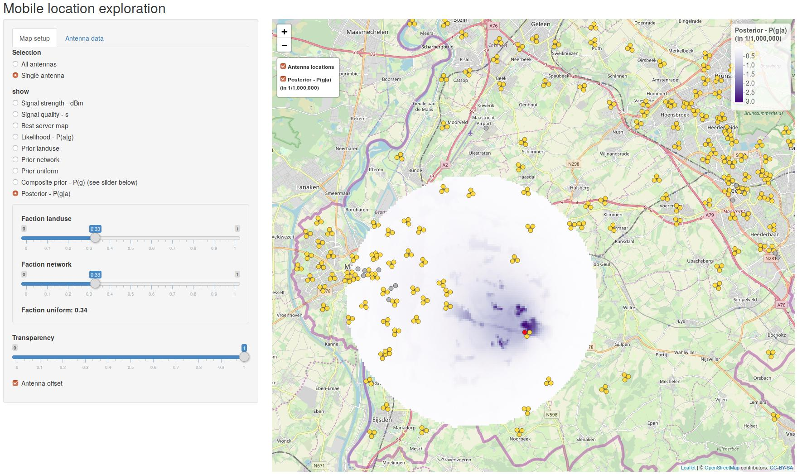

```{r setup, include = FALSE}
knitr::opts_chunk$set(
  collapse = TRUE,
  comment = "#>"
)
```


## Introduction

Mobile phone network data is data generated by the network of antennas owned by a mobile network operator (MNO). The MNO facilitates mobile communication and charges the corresponding costs to its customers. Most countries have more than one MNO, each of whom owns and maintains their own network of antennas. 

The data that is stored by the network is called Call Detail Records (CDR) or signalling data. CDR are used for billing purposes and only contains records about calls, SMS messages and mobile data use. Signalling data also contains records when a device moves across the network, and is primarily used for network analysis and optimisation. What type of records are stored depends on many factors, such as the network infrastructure, the network technology (3G or 4G), and the type of mobile phone. CDR and signalling data have an international standard.

Data collected from the mobile phone network do typically not contain the exact geographic location of the logged events. Instead, only the id number of the site and the antenna are included. The site refers to the construction that contains one or more antennae, e.g. a cell tower. The `mobloc` package contains a set of tools to approximate the location of mobile phone devices. For this approximation, the signal strength of the antennas are modelled. Also, the fact that the coverage areas of antennas may overlap is taken into account, as well as prior information such as land use.

Besides the mobile phone network data (CDR or signalling data), the *cellplan* is needed for the estimation of geographic locations. It contains the metadata of the antennas. The number of variables that are included may vary. The more variables included, the better. The only required variables are the latitude and longitude of the antennas. Other useful variables are: direction, height, (horizontal) tilt, horizontal beam width, vertical beam width, and power. These variables are used in `mobloc` to approxiamate the location of mobile phone devices. There may be other, more advanced, variables that are useful to estimate the geographic location, such as *Timing Advance*. There are no methods implemented yet to use these variables. Also *Best Server Maps* (BSM) cannot be used as a source, but they can be used for validation. The `mobloc` package models BSM, which can be compared to the BSM of the MNO.

The methods used in this package are described in [1], which is recommended to read first. Note that this document is a little outdated: this package is already more advanced. A paper on the methods of mobloc will be available soon (expected round April 2019).


```{r echo=FALSE, message=FALSE}
library(mobloc)
```

## Setup signal strength model parameters

The first step to approximate the geographic locations, is to determine the parameters for the signal propagation model. The default parameters can be loaded with the function `prop_param`. The result is a standard list:

```{r}
ZL_param <- prop_param()
```

A short description of the parameters is provided in the table below. These parameters are used to model the signal strenght. Most parameters are default values for parameters that are often unknown. For imputing unkown parameters, we consider two types of antennas: normal antennas, which are placed in cell towers or on roof tops, and small cells, which are placed indoors or in dense urban areas (e.g. on street lights). Since these two types antenans of antennas have very different characteristics, they also have different default values. E.g. the power of a normal antenna is set to 10 Watt for normal antennas and 5 Watt for small cells.

The following table describes the parameters. More detailed information can be found in [1].

| Parameter     |  Description  (related to signal strength) |
| ------------- |:-------------------------------------------------------------------------|
| W      | Power in Watt of a normal antenna |
| W_small      | Power in Watt of a small cell antenna |
| ple      | Power in Watt of a small cell antenna |
| ple_small      | Power in Watt of a small cell antenna |
| ple_0      | Power in Watt of a small cell antenna |
| ple_1      | Power in Watt of a small cell antenna |
| azim_min3dB      | Horizontal beam width $\gamma_j$ in [1]) |
| azim_dB_back      | Signal strength at the back of the cell in the azimuth plane |
| elev_min3dB      | Vertical beam width $\theta_j$ in [1]) |
| elev_dB_back     | Signal strength at the back of the cell in the elevation plane |
| dBm_mid      | Midpoint of the logistic transformation ($S^{mid}$ in [1]) |
| dBm_width      | Width of the logistic transformation ($S^{width}$ in [1]) |
| range      | Maximum range of normal antennas |
| range_small      | Maximum range of small cells  |
| height      | Height of a normal antenna (above ground level) |
| height_small      | Height of a small cell (above ground level)  |
| tilt      | Tilt of an antenna |
| beam_v      | Vertical beam width |
| beam_h      | Horizontal beam width |
| dBm_th      | Signal strength threshold (in dBm) |
| max_overlapping_cells      | Maximum amount of antennas that have overlapping coverage areas |

The `mobloc` package contains a tool in which these parameters can be tuned. This tool is started as follows:

```{r eval = FALSE}
setup_prop_model()
```


This tool shows the modeled the propagation for one antenna. The left hand side panel shows the settings of the propagation model, which are by default set to values of the list we just created with `prop_param`. When *small cell* is ticked, the `_small` arguments are used. The plots on the right hand side shows the propagation results. The heatmap on the top right shows the top view of the signal strength of the antenna. For normal antennas, the direction in this plot is east. Small cells are omniirectional.

The four plots below the heatmap describe:

* The top left line diagram shows yhe signal loss as a function of the distance. The parameters that influence this are the antenna power (`W`) and the path loss exponent (`ple`), which reflects the environment of the antenna: 2 can be used for free space, 4 for urban areas, and 6 for buildings.
* The top right line diagram shows the signal quality as a function of the signal strength in dBm.  It can be interpreted as the quality of connection, based on the assumption that for a mobile phone network, it is not important whether the connection is good (say -90 dBm) or extreme good (say -70 dBm). Instead, load balancing is much more important when there are multiple antennas to choose from. Therefore, we applied a logistic function on the signal strength to flatten both tails. This function can be adjusted with the parameters `dBm_mid` and `dBm_width`.
* The bottom two plots illustrate the radiation pattern in the horizontal/azimuth plane the the vertical/elevation plane. The black contour lines indicate the signal loss as a function of the offset angle. The red points are the -3dB points, i.e. the angle at which the signal loss is 3 dB. These radiation plots can also be generated directly in R with the function `radiation_plot`. The parameters `azim_min3dB`, `azim_dB_back`, `elev_min3dB`, and `elev_dB_back` have influence on these radiation pattern.

## Loading artificial cellplan data

When the parameters have been set, the model can be applied to cellplan data. To illustrate the model, we included artificial data to this package. This data can be loaded as follows:

```{r}
data("ZL_cellplan", "ZL_muni", "ZL_elevation", "ZL_landuse")
```

It is artifical cellplan data from the NUTS3 region Zuid-Limburg, the most southern part of the Netherlands, which is roughly 30 by 30 kilometres large. 

The object `ZL_cellplan` is an `sf` object (see packge `sf`) that contains all the geopgraphic locations of the antennas and the metadata.

```{r}
ZL_cellplan
```

The object `ZL_land` is a large multipolygon that defines the area. The object `ZL_elevation` is a `raster` object that contains the elevation heigths at 100 by 100 metre detail.

These example data can be plot with the `tmap` package

```{r eval=FALSE}
library(tmap)
tmap_mode("view")
qtm(ZL_elevation) + qtm(ZL_muni, fill=NULL) + qtm(ZL_cellplan)
```


The object `ZL_landuse` is a raster object that contains fractions of land that is used for several categories. We will use this information later on to determine the level of urbanization per antenna and to define prior information.

```{r}
ZL_envir <- combine_raster_layers(ZL_landuse, weights = c(1, 1, 1, 0, 0)) 
```

The function `validate_cellplan` should be used to validate the cellplan. It checks if required variables are present. Variables that are not required as input, but needed for further analysis are imputed. For instance, if `tilt` is missing, it is imputed by the default value `ZL_param$tilt`. Also, 


```{r}
ZL_cellplan <- validate_cellplan(ZL_cellplan, param = ZL_param, region = ZL_muni, envir = ZL_envir, elevation = ZL_elevation)
```


The corresponding bounding box of Zuid-Limburg is created as follows.

```{r}
library(sf)
ZL_bbox <- st_bbox(c(xmin = 172700, ymin = 306800, xmax = 204800, ymax = 342700), crs = st_crs(28992))
```

## Modelling the signal propagation

In the next stage, the signal propagation is modelled. This is done with rasterization, i.e. all spatial objects are transformed into small raster cells, e.g. of 100 by 100 meters. This is mainly done for computational reasons. The raster is created as follows:

```{r eval=TRUE}
# create a raster of 100 by 100 meter cells
ZL_raster <- create_raster(ZL_bbox)
```

This object is a `raster` object that contains the raster id values, which are numbered from top left to bottom right row-wise.

For each raster cell $g$ and antenna $a$ where $g$ intersects with the polygon of $a$, the following variables are computed: the distance, the modelled signal strength, the relative signal strength, and the liklihood value. The function for these calculations, called `process_cellplan`, supports parallel computing. A parallel cluster can be created as follows:


```{r eval=FALSE}
# create a parallel cluster
require(parallel)
require(doParallel)
ncores <- detectCores()
cl <- makeCluster(ncores)
registerDoParallel(cl)
```

Note that it is not required to create a parallel cluster in order to process the cellplan. It is recommended for large cellplans since it reduced the computation time significantly. 

```{r eval=TRUE}
# calculate probabilities
ZL_prop <- process_cellplan(cp = ZL_cellplan, raster = ZL_raster, elevation = ZL_elevation, param = ZL_param)
ZL_prop
```

The result is a `data.frame` that contains information about the modelled propagation (that is where the abbreviation `prop` stands for). It has the following columns: 

* `Cell_name` The identification numbers or names of the antennas.
* `rid` Raster cell id number. These are numbered according to the cells of specified raster object, in our example `ZL_raster`. The first number corresponds to the top left cell, and the sequence of numbers is row-wise.
* `dist` Distance from the antenna location to the center of the grid cell.
* `dBm` Signal strength in dBm.
* `s` The relative signal strength. The signal strength (dBm) is 
* `pag` The likelihood value. More speficically, it is the probability that a certain antenna is used given that the device is located in a certain the grid cell.

## Mobile location approximation

The propagation results, in our example `ZL_prop`, contains the propagation and likelihood values. In order to approximate the location of mobile devices, prior information can be used additionally. For each raster cell, a probability is assigned based on prior knowledge such as land use.

In this example, we propose three priors:

* A uniform prior. In this prior, every raster cell has the same prior probability. So no additional information is used.
* A network prior. The antennas are not placed without reason: an MNO (mobile network operator) will probably place more antennas in dense areas. This information can be seen as prior information. We will extract this information from the propagation model.
* A land use prior. The prior probability depends on the land use. The general philosophy behind this approach is that in urban areas, it is more likely to espect people than in rural areas. In the example below, we create a weigthed prior, in which we assign a weight per land use category.

```{r eval=TRUE}
ZL_uniform_prior <- create_uniform_prior(ZL_raster)
ZL_network_prior <- create_network_prior(ZL_prop, ZL_raster)
names(ZL_landuse) # display the land use classes in this raster brick
ZL_landuse_prior <- create_prior(ZL_landuse, weights = c(1, 1, .1, 0, .5))
```

Since each of the previous priors have pros and cons, it may be worthwile to create a composite prior in order to find good balance. In this example we use the network prior for `25%` and the land use prior for `75%`.

```{r eval=TRUE}
ZL_comp_prior <- create_prior(ZL_network_prior, ZL_landuse_prior, weights = c(.25, .75))
```

The result can be visualized using `tmap`:


```{r eval=FALSE}
qtm(ZL_comp_prior)
```


The following tool is used to explore the following results:

* the modelled propagation per antenna: the absolute signal strength in dBm, the signal quality, and the best server map (i.e. the best antanna per grid cell). These maps can also be created directly with the functions `ZL_coverage_map` and `ZL_best_server_map`.
* the specified priors, as well as a composite prior
* the likelihood `P(a|g)`, that is the propapility that a mobile device connects to antenna `a` given that it is located in grid cell `g`
* the probability that is regarderd as the final result of mobloc: `P(g|a)`, the probability that a mobile phone is located in grid cell `g`, given that it is connected to antenna `a`.

```{r eval=FALSE}
explore_mobloc(ZL_cellplan, ZL_raster, ZL_prop, list(landuse = ZL_landuse_prior, network = ZL_network_prior, uniform = ZL_uniform_prior),  ZL_param)
```




This tool can be used to verify the results. The final result, `P(g|a`), can be calculated as follows:

```{r}
ZL_pga <- calculate_mobloc(ZL_prop, prior = ZL_comp_prior, raster = ZL_raster)
ZL_pga
```


## Reference
[1] Tennekes, M., 2018, Geographic Location of Mobile Phone Events, [`vignette("geographic location events")`](../doc/geographic-location-events.pdf)

