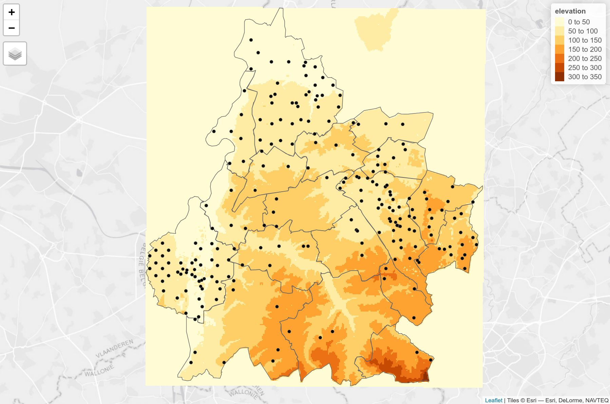

```{r setup, include = FALSE}
knitr::opts_chunk$set(
  collapse = TRUE,
  comment = "#>"
)
```


## Introduction

Mobile phone network data is data generated by the network of antennas owned by a mobile network operator (MNO). The MNO facilitates mobile communication and charges the corresponding costs to its customers. Most countries have more than one MNO, who each own and maintain their own network of antennas. When using a mobile phone abroad, the foreign MNO that provides mobile communication forwards the usage costs to the primary MNO.

Each time a device interacts with an antenna in the network, a record is generated. Two types of records can be distinguished: call detail records (CDR) and network events. CDR data contain information about calls, SMS messages and mobile data usage and are used to bill customers. This information contains the date, time, location, and duration (only for calls) of events, but not the content of the communication. Network events are passively generated when a mobile phone moves from one antenna to another, even if it is not actively being used. Signalling data includes both CDR data and network event data. The primary use of signalling data is network analysis and optimisation. CDR and signalling data have an international standard.

Data collected from the mobile phone network do typically not contain the exact geographic location of the logged events. Instead, only the id number of the site and the antenna are included. The site refers to the construction that contains one or more antennae, e.g. a cell tower. The `mobloc` package contains a set of tools to approximate the location of mobile phone devices. For this approximation, the signal strength of the antennas are modelled. Also, the fact that the coverage areas of antennas may overlap is taken into account.

Besides the mobile phone network data (Call Detail Records or signalling data), the *cellplan* is needed for the estimation of geographic locations. It contains the metadata of the antennas. The number of variables that are included may vary. The more variables included, the better. The only required variables are the latitude and longitude of the antennas. Other useful variables are: height, (horizontal) tilt, direction, horizontal beam width, vertical beam width, and the type of antenna. These variables are used in `mobloc` to approxiamate the location of mobile phone devices. There may be other, more advanced, variables that are useful to estimate the geographic location, such as *Timing Advance*. However, there are no methods implemented yet to use these variables. Also *Best Area Maps* are not used yet.

The methods used in this package are described in [1], which is recommended to read first.


```{r echo=FALSE, message=FALSE}
library(mobloc)
```

## Setup location model parameters

The first step to apply the approximate the geographic locations, is to determine the model parameters. The default parameters can be loaded with the function `location_model_parameters`. The result is a standard list:

```{r}
param <- location_model_parameters()
str(param)
```

A short description of the parameters is provided in the table below. Some of these parameters are already discussed in [1]. The first set of eight parameters are used to model the signal strength. The second set of five parameters are used to determine the coverage area. The parameters will be explained in more detail when needed.


| Parameter     |  Description  (related to signal strength) |
| ------------- |:-------------------------------------------------------------------------|
| db0_tower      | Signal strength at 1 meter from cell ($S_0$ in [1]) for normal antennas |
| db0_small      | Signal strength at 1 meter from cell ($S_0$ in [1]) for small cells  |
| azim_min3dB      | Horizontal beam width $\gamma_j$ in [1]) |
| azim_dB_back      | Signal strength at the back of the cell in the azimuth plane |
| elev_min3dB      | Vertical beam width $\theta_j$ in [1]) |
| elev_dB_back     | Signal strength at the back of the cell in the elevation plane |
| db_mid      | Midpoint of the logistic transformation ($S^{mid}$ in [1]) |
| db_width      | Width of the logistic transformation ($S^{width}$ in [1]) |

| Parameter     |  Description  (related to coverage area) |
| ------------- |:-------------------------------------------------------------------------|
| poly_shape      | Baisc shape of the cell coverage area, one of `"pie"`, `"oval"`, `"Voronoi"`
| max_range      | Maximum range of normal antennas |
| max_range_small      | Maximum range of small cells  |
| min_range      | Minimum range of normal antennas |
| min_range_small      | Minimum range of small cells  |
| area_expension      | Expension factor of cell areas used to allow overlap |
| max_overlapping_cells      | Maximum amount of cells that are overlapping each other |


The `mobloc` package contains a tool in which the first set of eight parameters can be tuned. This tool is started as follows:

```{r eval = FALSE}
param_current <- cell_modelling_tool(param_default)
```


All parameter values that are set with the interactive tool are silently returned by `cell_modelling_tool`, and in this example assigned to `param_current`. The function `update_model_parameters` can also be used to change parameters.


The top left box shows the settings of a cell which should be contained in the cellplan, namely, the height, the horizontal tilt ($\beta_j$ in [1]), and whether it is a small cell (i.e. omnidirectional). If these variables are not available, not all tools from the `mobloc` package can be used.

The top right plot shows the top view of the signal strength of the cell. If *small cell* is unticked, than the azimuth direction ($\alpha_j$ in [1]) is east.

The next input boxes on the leftside of the screen configure the cells. These parameters are often contained in the cellplan. If not, the default parameters can be used. The first parameter is `db0_tower` or `do0_small` depending on whether the *small cell* checkbox is ticked. Notice that different default settings are used (-45dBm for normal antennas, and -60dBm for small cells), since cells contained in cell towers and on rooftop are often much stronger than small cells. The top left plot below the heatmap shows the signal loss as a function of the distance (see equation (4) in [1]).

The next two input boxes contain the -3dB angles and dB back values for both the horizontal (azimuth) and vertical (elevation) planes. The radiation area of a cell can be seen as a three dimensional bulb. In the main direction (e.g. the direction in which the cell radiates) there is no loss in signal strength, irrespective of the distance. However, at a certain offset, there is signal loss. The -3dB angle is the angle at which the signal is halved. These angles (both for the horizontal and vertical plane) are usually contained in the cellplan. The dB back points are signal loss ratios between the front and the back of the cell. The two plots the the right bottom of the screen illustrate the radiation pattern in the horizontal/azimuth plane the the vertical/elevation plane. The black contour lines indicate the signal loss as a function of the offset angle. The red points are the -3dB points. These radiation plots can also be generated directly in R:

```{r eval=FALSE}
radiation_plot(beam_width = 65, db_back = -30)
radiation_plot(type = "e", db_back = -30, beam_width = 9)
```


The output type sets the type of radiation plot that is shown in the heatmap. dBm means the absolute signal strength value, and the likelihood the likelihood of connection, given the abolute signal strength values. 

The transformation from absolute signal strength values to the likelood values is achieved by applying a logistic function, which is parameterized by `dm_mid` ($S^{mid}$ in [1]) and and `db_width` ($S^{width}$ in [1]). The reason to apply such a transformation is that the probability of connection not only depends on the signal strength, but also on load balancing. For load balancing, the tails of the distribution are less important, e.g. whether a signal is very good (say -80dBm) or superb (say -70 dBm) is less important than the availability of that cell. The transformation function is plotted in the top right chart below the heatmap. The transformation is defined in equations (6) and (7) of [1].

## Loading artificial cellplan data

When the parameters have been set, the model can be applied to cellplan data. To illustrate the model, we included artificial data to this package. This data can be loaded as follows:

```{r}
data("ZL_cellplan", "ZL_land", "ZL_elevation")
```

It is artifical cellplan data from the NUTS3 region Zuid-Limburg, the most southern part of the Netherlands, which is roughly 30 by 30 kilometres large. 

The object `ZL_cellplan` is an `sf` object (see packge `sf`) that contains all the geopgraphic locations of the cells and the metadata.

```{r}
head(ZL_cellplan)
```

The object `ZL_land` is a large multipolygon that defines the area. The object `ZL_elevation` is a `raster` object that contains the elevation heigths at 100 by 100 metre detail.

These example data can be plot with the `tmap` package

```{r eval=FALSE}
library(tmap)
tmap_mode("view")
qtm(ZL_elevation) + qtm(ZL_land, fill=NULL) + qtm(ZL_cellplan)
```



The corresponding bounding box of Zuid-Limburg is created as follows.

```{r}
library(sf)
ZL_bbox <- st_bbox(c(xmin = 172700, ymin = 306800, xmax = 204800, ymax = 342700), crs = st_crs(28992))
```

## Creating cell polygons


The first step is to create a polygon for each cell. Polygons are created with the function `create_cellplan_polygons`. We can create three types of polygons: `pie`, `oval` (pie with round edges), or `Voronoi`. The polygons defines the overall coverage area of a cell. However, the signal strength may vary within this coverage area. It is recommended to define the polygons are large as possible. However, the computation time increases a lot when the polygons are too large, especially when there is much overlap.

First, let us illustrate a Voronoi tessalation. For this we create a new parameter list, where we only adjust the polygon shape.

```{r eval=FALSE}
param_voronoi <- update_model_parameters(param_current, poly_shape = "Voronoi")
ZL_voronoi <- create_cellplan_polygons(ZL_cellplan, ZL_land, ZL_bbox, param = param_voronoi)
```

The `sf` object `ZL_voronoi` contains polygons for every cell. When cells are directional, the centroids for which the Voronoi polygons are generated, are shifted 100 meters in the direction of radiation. The major advantage of this adjustment to the Voronoi algorithm is achieved when there are multiple cells per site, typically 120 degrees apart. The result is that due to the shifted geographic locations, a Voronoi polygon is created for each cell.

The result can be visualized and inspected as follows.

```{r eval=FALSE}
qtm(ZL_voronoi) + qtm(ZL_cellplan)
```


As discussed in [1], there are a couple of downsides to the Voronoi tesselation. The most important one is that in reality, cells overlap in order to make to mobile phone network robust and dynamic. When a cell tower is out of order, or when the capacity is reached, other nearby cells can take over the connections.

In the following line of code, we create polygons that have a shape of an oval. The size is upper bounded by the parameters `max_range` and `max_range_small` for normal and small cells respectively. The sizes of the polygons are determined as follows. Under the hood, a Voronoi tesselation is generated, just like we did before. The sizes of those Voronoi polygons times the parameter `area_expension` determine the sizes of the polygons. The result is that cells in urban areas have smaller coverage areas, but still overlap each other.

```{r eval=FALSE}
ZL_poly <- create_cellplan_polygons(ZL_cellplan, ZL_land, ZL_bbox, param = param_current)
qtm(ZL_poly) + qtm(ZL_cellplan)
```


Recall that each of these polygons only determines the coverage area of the corresponding cell, but not the signal strength. At this stage, the shape of the polygons is not very important, as long as it covers the area for which the signal strength is expected to by high.

## Calculating relative signal strength probabilites

In the final stage, the relative signal strength probabilities are calculated. See equation (1) in [1]. These are the probabilities of presence at a certain grid cell (say 100 by 100 metres) given the id of the logged cell. Recall that these probabilities depend on the relative signal strengths (see $s(i,j)$ in equation (6) in [1]) of the logged cell as well the cells that also have coverage at the corresponding location.

The function to calculate these relative signal strength probabilities, called `rasterize_cellplan`, supports parallel computing. The `mobloc` package contains a couple of functions to manage the parallel backend:

```{r eval=FALSE}
current_cluster()
# No cluster defined.
start_cluster(4)
# Cluster with 4 nodes created.
current_cluster()
# Cluster with 4 nodes found.
stop_cluster()
# Cluster with 4 nodes stopped.
```

The following code chunk will calculate the relative signal strength probabilities. It returns a `data.frame` which consists of the following variables: `Cell_name`, `rid` (raster cell id), `p` (probabilities), `s` (relative signal strength), `dist` the distance between the cell and the raster cell, and `db` the signal strength in dBm.

```{r eval=FALSE}
ZL_raster <- create_raster(ZL_bbox)
ZL_prob <- rasterize_cellplan(cp = ZL_cellplan, cp_poly = ZL_poly, raster = ZL_raster, elevation = ZL_elevation, param = param_current)
```

The result can be visualized using `cell_inspection_tool`.

```{r eval=FALSE}
cell_inspection_tool(ZL_cellplan, ZL_poly, ZL_raster, ZL_prob, param_current)
```


## Reference
[1] Tennekes, M., 2018, Geographic Location of Mobile Phone Events, [`vignette("geographic location events")`](../doc/geographic-location-events.pdf)

